# Лабораторная работа №6
## Тема: Использование шаблонов проектирования
**Проект:** система управления бронированиями и номерным фондом для high-end курортов и spa-отелей.

### Что было сделано
За основу взят проект ЛР5 (frontend + backend + PostgreSQL). Для ЛР6 поверх той же предметной области выделен пакет `lab6_patterns`, в котором показаны шаблоны GoF на примерах бронирований, номеров, уведомлений, смарт-замков и сервисного слоя.

---

# 1. Шаблоны проектирования GoF

## 1.1. Порождающие шаблоны

### 1) Prototype
**Общее назначение.** Создание нового объекта путём копирования уже существующего шаблона.

**Назначение в проекте.** Для типов номеров (`standard`, `comfort`, `lux`) удобно хранить шаблонные настройки (например, набор удобств) и клонировать их при создании конкретного номера.

**UML-диаграмма.**
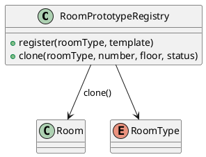

**Фрагмент кода.** Файл `lab6_patterns/creational.py`:
```python
class RoomPrototypeRegistry:
    def __init__(self) -> None:
        self._templates: dict[RoomType, Room] = {}

    def register(self, room_type: RoomType, template: Room) -> None:
        self._templates[room_type] = template

    def clone(self, room_type: RoomType, *, number: str, floor: int, status: RoomStatus = RoomStatus.AVAILABLE) -> Room:
        template = deepcopy(self._templates[room_type])
        template.number = number
        template.floor = floor
        template.status = status
        return template
```

Такой вариант хорошо подходит для премиальных отелей, где у каждого типа номера есть общий набор базовых характеристик.

### 2) Builder
**Общее назначение.** Пошаговая сборка сложного объекта с контролем обязательных параметров.

**Назначение в проекте.** Бронирование создаётся не одной строкой, а через последовательную сборку: гость, номер, даты, цена.

**UML-диаграмма.**
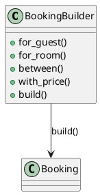

**Фрагмент кода.** `lab6_patterns/creational.py`:
```python
class BookingBuilder:
    def __init__(self) -> None:
        self._draft = BookingDraft()

    def for_guest(self, guest_id: int) -> "BookingBuilder":
        self._draft.guest_id = guest_id
        return self

    def for_room(self, room_id: UUID) -> "BookingBuilder":
        self._draft.room_id = room_id
        return self

    def between(self, check_in: date, check_out: date) -> "BookingBuilder":
        self._draft.check_in = check_in
        self._draft.check_out = check_out
        return self

    def with_price(self, total_price: float) -> "BookingBuilder":
        self._draft.total_price = total_price
        return self

    def build(self) -> Booking:
        if None in (self._draft.guest_id, self._draft.room_id, self._draft.check_in, self._draft.check_out):
            raise ValueError("BookingBuilder: not all mandatory fields are set")
        return Booking(...)
```

Builder делает код безопаснее и читабельнее, особенно если дальше у бронирования появятся доп. услуги, тарифы, промокоды и т.д.

### 3) Factory Method
**Общее назначение.** Делегировать создание объекта подклассам, не жёстко связывая вызывающий код с конкретным классом.

**Назначение в проекте.** Подтверждение бронирования может отправляться по e-mail, SMS или push, а выбор канала можно менять фабрикой.

**UML-диаграмма.**
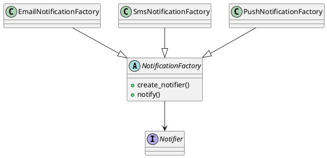

**Фрагмент кода.** `lab6_patterns/creational.py`:
```python
class NotificationFactory(ABC):
    @abstractmethod
    def create_notifier(self) -> Notifier:
        raise NotImplementedError

    def notify(self, guest_id: int, message: str) -> None:
        notifier = self.create_notifier()
        notifier.send(guest_id, message)

class EmailNotificationFactory(NotificationFactory):
    def create_notifier(self) -> Notifier:
        return EmailNotifier()
```

При смене канала уведомлений не нужно переписывать сервис бронирования.

---

## 1.2. Структурные шаблоны

### 4) Adapter
**Общее назначение.** Привести несовместимый интерфейс стороннего компонента к нужному интерфейсу системы.

**Назначение в проекте.** Интеграция со смарт-замками: у внешнего поставщика один формат API, а нашей системе нужен унифицированный `LockPort`.

**UML-диаграмма.**
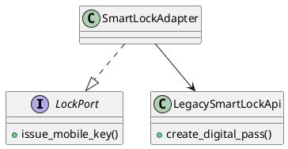

**Фрагмент кода.** `lab6_patterns/structural.py`:
```python
class LegacySmartLockApi:
    def create_digital_pass(self, room_number: str, guest_code: str, valid_from: str, valid_to: str) -> str:
        return f"legacy-key::{room_number}::{guest_code}::{valid_from}::{valid_to}"

class SmartLockAdapter(LockPort):
    def __init__(self, legacy_api: LegacySmartLockApi) -> None:
        self.legacy_api = legacy_api

    def issue_mobile_key(self, room: Room, booking: Booking) -> str:
        return self.legacy_api.create_digital_pass(...)
```

Adapter особенно уместен в этом проекте, потому что интеграции с внешними провайдерами — реальная часть предметной области.

### 5) Facade
**Общее назначение.** Дать один упрощённый интерфейс к группе связанных подсистем.

**Назначение в проекте.** Бронирование в отеле затрагивает сразу несколько компонентов: комнату, репозитории, уведомления и выдачу мобильного ключа. Всё это объединено фасадом `ReservationFacade`.

**UML-диаграмма.**
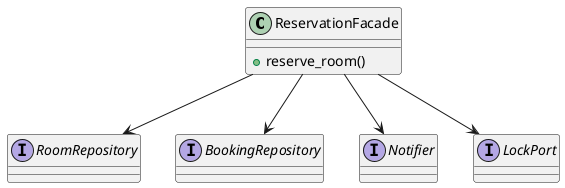

**Фрагмент кода.** `lab6_patterns/structural.py`:
```python
class ReservationFacade:
    def __init__(self, room_repository, booking_repository, notifier, lock_service) -> None:
        self.room_repository = room_repository
        self.booking_repository = booking_repository
        self.notifier = notifier
        self.lock_service = lock_service

    def reserve_room(self, room: Room, booking: Booking) -> tuple[Booking, str]:
        room.status = RoomStatus.RESERVED
        self.room_repository.save(room)
        saved_booking = self.booking_repository.save(booking)
        mobile_key = self.lock_service.issue_mobile_key(room, saved_booking)
        self.notifier.send(booking.guest_id, f"Бронирование подтверждено. Ключ: {mobile_key}")
        return saved_booking, mobile_key
```

Через фасад контроллер или внешний сценарий видит одну “точку входа”, а не множество низкоуровневых вызовов.

### 6) Decorator
**Общее назначение.** Динамически добавлять объекту новую функциональность без изменения его класса.

**Назначение в проекте.** Для уведомлений можно добавить журналирование, не меняя сами `EmailNotifier`, `SmsNotifier` и т.д.

**UML-диаграмма.**
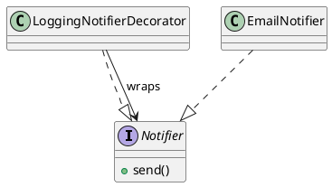

**Фрагмент кода.** `lab6_patterns/structural.py`:
```python
class LoggingNotifierDecorator(Notifier):
    def __init__(self, wrapped: Notifier) -> None:
        self.wrapped = wrapped
        self.log: list[str] = []

    def send(self, guest_id: int, message: str) -> None:
        self.log.append(f"guest={guest_id}: {message}")
        self.wrapped.send(guest_id, message)
```

Это хороший способ добавить аудит и отладку, не “ломая” уже готовые классы уведомлений.

### 7) Proxy
**Общее назначение.** Контролируемый доступ к объекту, например с кэшированием, ленивой загрузкой или дополнительной проверкой.

**Назначение в проекте.** Каталог свободных номеров можно кэшировать, чтобы не ходить каждый раз в репозиторий.

**UML-диаграмма.**
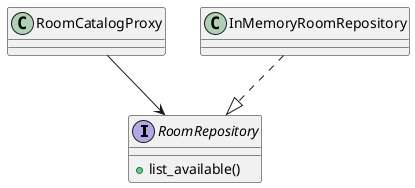

**Фрагмент кода.** `lab6_patterns/structural.py`:
```python
class RoomCatalogProxy:
    def __init__(self, room_repository: RoomRepository) -> None:
        self.room_repository = room_repository
        self._cache: list[Room] | None = None

    def list_available_rooms(self) -> list[Room]:
        if self._cache is None:
            self._cache = self.room_repository.list_available()
        return [replace(room) for room in self._cache]
```

Прокси полезен для дорогих операций чтения, когда список свободных номеров запрашивается часто.

---

## 1.3. Поведенческие шаблоны

### 8) Strategy
**Общее назначение.** Вынести взаимозаменяемые алгоритмы в отдельные классы и выбирать их во время выполнения.

**Назначение в проекте.** Расчёт стоимости проживания зависит от сезона: обычный тариф или тариф высокого сезона.

**UML-диаграмма.**
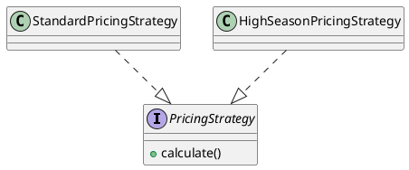

**Фрагмент кода.** `lab6_patterns/behavioral.py`:
```python
class StandardPricingStrategy:
    BASE = {"standard": 100.0, "comfort": 150.0, "lux": 250.0}

    def calculate(self, room: Room, nights: int) -> float:
        return self.BASE[room.room_type.value] * nights

class HighSeasonPricingStrategy:
    BASE = {"standard": 100.0, "comfort": 150.0, "lux": 250.0}

    def calculate(self, room: Room, nights: int) -> float:
        return self.BASE[room.room_type.value] * nights * 1.35
```

Добавить новый алгоритм тарификации можно без изменения остального кода.

### 9) Observer
**Общее назначение.** Организовать подписку на события, чтобы при изменении объекта автоматически оповещать зависимые компоненты.

**Назначение в проекте.** После создания или изменения бронирования можно уведомить сразу несколько подписчиков: аудит и канал уведомлений гостя.

**UML-диаграмма.**
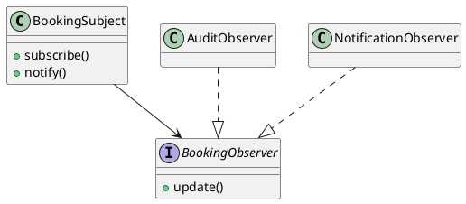

**Фрагмент кода.** `lab6_patterns/behavioral.py`:
```python
class BookingSubject:
    def __init__(self) -> None:
        self._observers: list[BookingObserver] = []

    def subscribe(self, observer: BookingObserver) -> None:
        self._observers.append(observer)

    def notify(self, booking: Booking) -> None:
        for observer in self._observers:
            observer.update(booking)
```

Observer убирает жёсткую связанность между бизнес-событием и его последствиями.

### 10) Command
**Общее назначение.** Представить действие как объект, который можно хранить, передавать и выполнять.

**Назначение в проекте.** Создание и отмена бронирования оформлены как команды. Это удобно для журналирования, очередей и последующего undo/redo.

**UML-диаграмма.**
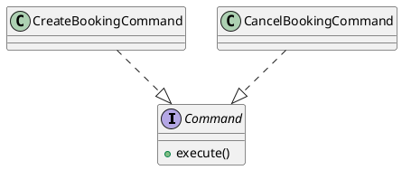

**Фрагмент кода.** `lab6_patterns/behavioral.py`:
```python
class CreateBookingCommand:
    def __init__(self, workflow, guest_id: int, room: Room, check_in: date, check_out: date) -> None:
        self.workflow = workflow
        self.guest_id = guest_id
        self.room = room
        self.check_in = check_in
        self.check_out = check_out

    def execute(self) -> Booking:
        return self.workflow.run(self.guest_id, self.room, self.check_in, self.check_out)
```

Команды хорошо ложатся на сервисную архитектуру, где отдельные операции могут отправляться в очередь или журнал.

### 11) State
**Общее назначение.** Инкапсулировать поведение объекта в зависимости от его текущего состояния.

**Назначение в проекте.** Для номера важно управлять переходами между состояниями: свободен, забронирован, выведен из эксплуатации.

**UML-диаграмма.**
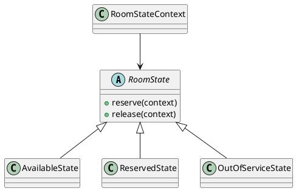

**Фрагмент кода.** `lab6_patterns/behavioral.py`:
```python
class AvailableState(RoomState):
    def reserve(self, context: "RoomStateContext") -> None:
        context.room.status = RoomStatus.RESERVED
        context.state = ReservedState()

class ReservedState(RoomState):
    def release(self, context: "RoomStateContext") -> None:
        context.room.status = RoomStatus.AVAILABLE
        context.state = AvailableState()
```

State предотвращает хаотические переходы и делает правила жизненного цикла номера явными.

### 12) Template Method
**Общее назначение.** Задать каркас алгоритма в базовом классе, оставив отдельные шаги переопределяемыми в подклассах.

**Назначение в проекте.** Процесс оформления бронирования всегда проходит одинаковые этапы: валидация дат, подсчёт ночей, расчёт цены, сборка объекта, сохранение, уведомление. Различается только способ сохранения/подтверждения.

**UML-диаграмма.**
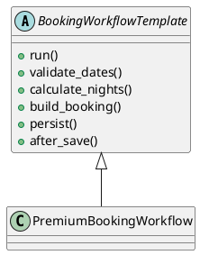

**Фрагмент кода.** `lab6_patterns/behavioral.py`:
```python
class BookingWorkflowTemplate(ABC):
    def run(self, guest_id: int, room: Room, check_in: date, check_out: date) -> Booking:
        self.validate_dates(check_in, check_out)
        nights = self.calculate_nights(check_in, check_out)
        price = self.pricing_strategy.calculate(room, nights)
        booking = self.build_booking(guest_id, room, check_in, check_out, price)
        booking = self.persist(booking)
        self.after_save(booking)
        return booking
```

Template Method позволяет стандартизировать сценарий бронирования и при этом поддерживать разные варианты workflow.

---

# 2. Краткий вывод по GoF
В рамках проекта удалось показать полный набор шаблонов из трёх групп:
- **Порождающие:** Prototype, Builder, Factory Method
- **Структурные:** Adapter, Facade, Decorator, Proxy
- **Поведенческие:** Strategy, Observer, Command, State, Template Method

---

# 3. Шаблоны GRASP 

## 3.1. Роли (обязанности) классов

### Information Expert
**Проблема.** Где размещать логику, которая зависит от внутренних данных объекта?

**Решение.** Например, `HighSeasonPricingStrategy` использует тип номера и число ночей — то есть работает там, где есть доступ к этим данным через `Room` и параметры бронирования.

**Результат.** Логика не размазывается по контроллерам.

**Связь с другими паттернами.** Strategy.

### Creator
**Проблема.** Кто должен создавать объект бронирования?

**Решение.** Эту ответственность берёт `BookingBuilder`, потому что именно он по шагам собирает все части будущего объекта.

**Результат.** Упрощается контроль обязательных полей.

**Связь с другими паттернами.** Builder.

### Controller
**Проблема.** Нужна точка, через которую проходит сценарий резервирования.

**Решение.** Эту роль берёт `ReservationFacade`.

**Результат.** Внешний код работает через один вход вместо множества вызовов.

**Связь с другими паттернами.** Facade.

### Indirection
**Проблема.** Как уменьшить связанность с внешним провайдером смарт-замков?

**Решение.** Используется `SmartLockAdapter`, который выступает промежуточным слоем.

**Результат.** Замена провайдера не ломает основной код.

**Связь с другими паттернами.** Adapter, Protected Variations.

### Pure Fabrication
**Проблема.** Некоторые классы удобнее выделить не из предметной области, а ради архитектурной чистоты.

**Решение.** `LoggingNotifierDecorator` — вспомогательный класс, который нужен ради расширения поведения.

**Результат.** Доменная модель не перегружается техническими деталями.

**Связь с другими паттернами.** Decorator.

## 3.2. Принципы разработки

### Low Coupling
Связанность снижена за счёт интерфейсов `Notifier`, `LockPort`, `RoomRepository`, `BookingRepository`. Компоненты зависят от абстракций, а не от конкретных реализаций.

### High Cohesion
Каждый класс выполняет одну понятную роль: Builder собирает бронирование, Strategy считает цену, Adapter работает с внешним API, Facade управляет сценарием.

### Protected Variations
Система защищена от изменений в точках вероятной нестабильности: каналы уведомлений, тарифные алгоритмы и внешние интеграции вынесены за абстракции и шаблоны.

## 3.3. Свойство программы 

### Maintainability / расширяемость
Главная цель — поддерживаемость и расширяемость системы. Код построен так, чтобы можно было:
- добавлять новый канал уведомлений;
- менять стратегию расчёта цены;
- подключать нового поставщика смарт-замков;
- менять workflow оформления бронирования.

Именно это свойство достигается сочетанием Facade + Adapter + Strategy + Template Method + Observer.

---